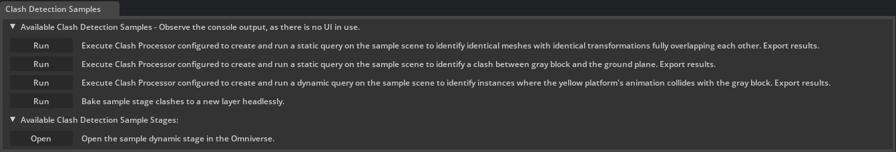

# Clash Detection Samples

## Overview

Python based clash detection samples extension.

## How to Build

Navigate to the root folder.

- On Windows execute `build.bat` file.
- On Linux execute `./build.sh` file.

## How to Run the Application

- On Windows navigate to `_build/windows-x86_64/release/` folder and run `omni.clashdetection.sample.kit.bat`
- On Linux navigate to `_build/linux-x86_64/release/` folder and run `./omni.clashdetection.sample.kit.sh`

## How to Execute Provided Samples

Clash Detection Samples pane should open automatically at the bottom part of the application.

You can also open the pane from the main menu Window->Physics->Clash Detection Samples.

Then you will be able to run sample(s) by clicking the `Run` button.

### ClashDetectionProcessor class

The ClashDetectionProcessor class (located in `clash_detection_processor.py` file) is designed to facilitate clash detection within 3D models using the Universal Scene Description (USD) framework.

It provides functionality to perform clash detection between specified objects or collections within a USD stage, with support for both static and dynamic analysis.

Additionally, the class allows for detailed configuration of the clash detection process, including the specification of tolerance levels, enabling detection of clearance clashes. The class also provides functionality for exporting the results of the clash detection for further analysis.

### ClashDetectionSamplesWindow

The ClashDetectionSamplesWindow class (located in `clash_detection_sample_window.py` file) provides a user interface (UI) component designed to interact with provided clash detection samples (only one sample is provided as of now).



It simplifies the process of running the sample by providing working setup on a sample stage, running the code and shows the exported results.

It also simplifies opening of a sample stage which, after running the sample, contains detected clash data.

## How to Open Clash Detection Main UI

Clash Detection main pane should open automatically at the bottom part of the application.

You can also open the pane from the main menu Window->Physics->Clash Detection.

Refer to [Clash Detection SDK documentation](https://docs.omniverse.nvidia.com/extensions/latest/ext_clash-detection.html#clashdetection) for more information.

## How to Integrate Clash Detection SDK Extensions into a Different Omniverse Application

This chapter describes a process how to enable Clash Detection SDK extensions in other Omniverse applications like for example USD Composer.

1.  First locate where Clash Detection SDK extensions reside

    - On Windows, such folder is located in `_build/windows-x86_64/release/extsClashDetection`.
    - On Linux, such folder is located in `_build/linux-x86_64/release/extsClashDetection`.

1.  Start the Omniverse application you are going to integrate Clash Detection SDK into (e.g. USD Composer).
    ```
    Important: Please make sure that Omniverse application is based on Kit version 106. You can find this information in the application About box.
    ```
1.  Go to Window->Extensions.
1.  Go to Settings (Hamburger menu on the right).
1.  To `Extension Search Paths` section, add the full path to Clash Detection SDK extension folder (explained in the first bullet point above).

    Note: do not append path separator (slash or a backslash) to the end of the path.

1.  Check the extensions 3rd party (second tab on the left).
1.  Enable `omni.physx.clashdetection.bundle` extension.

    Note: Also check the `AUTOLOAD` checkbox if you want to have Clash Detection Bundle loaded on each application run automatically.

1.  Restart the application.

1.  Click Window->Simulation->Clash Detection to open the main Clash Detection UI.
